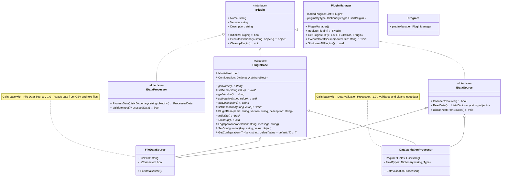

# Plugin Architecture with Abstraction

### 📋 Overview

Design and implement a comprehensive plugin system that demonstrates how interfaces and abstract classes enable extensible architectures. You'll create a plugin framework where new functionality can be added without modifying existing code, showcasing how abstraction supports the Open/Closed Principle.

This lab integrates the abstraction concepts you've learned while building a realistic software architecture that adapts and extends gracefully as new requirements emerge.

### 🎯 Learning Outcomes

By completing this lab, you will:

Design interface contracts that enable plugin extensibility

Create abstract base classes that provide shared functionality while requiring specific implementations

Build a plugin system that demonstrates how abstraction enables adding functionality without modifying existing code

### 🌎 Scenario

TechFlow Corporation is building a modular data processing application that needs to handle various data sources and transformation operations. The system should support plugins for different data sources (databases, files, APIs) and data processors (validation, transformation, export). Your task is to create a plugin architecture using interfaces and abstract classes that allows the company to add new data sources and processors without changing the core application code.

