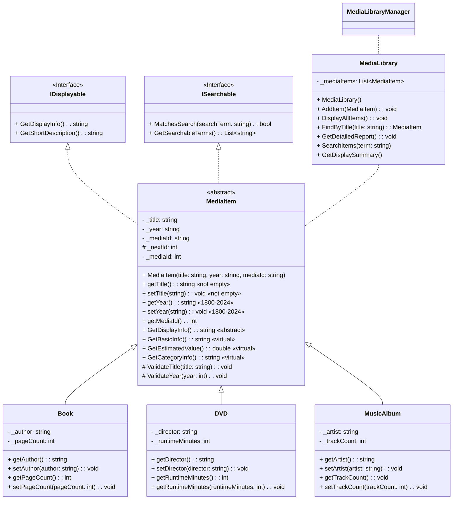

# Hands-on Course Project: Simple Media Library System

```mermaid
classDiagram
    direction TB

    MediaItem <|-- Book
    MediaItem <|-- DVD
    MediaItem <|-- MusicAlbum
    IDisplayable <|.. MediaItem
    ISearchable <|.. MediaItem
    MediaLibraryManager .. MediaLibrary
    MediaLibrary .. MediaItem

    class MediaItem {
        <<abstract>>
        - _title: string
        - _year: string
        - _mediaId: string

        # _nextId: int
        - _mediaId: int 

        + MediaItem(title: string, year: string, mediaId: string)

        + getTitle(): string «not empty»
        + setTitle(string): void «not empty»
        + getYear(): string «1800-2024»
        + setYear(string): void «1800-2024»
        + getMediaId(): int

        + GetDisplayInfo(): string «abstract»
        + GetBasicInfo(): string «virtual»

        + GetEstimatedValue(): double «virtual»
        + GetCategoryInfo(): string «virtual»

        # ValidateTitle(title: string): void
        # ValidateYear(year: int): void
    }

    class Book {
        - _author: string
        - _pageCount: int

     %%   + Book(title: string, year: string, mediaId: string, author: string, pageCount: int)

        + getAuthor(): string
        + setAuthor(author: string): void
        + getPageCount(): int
        + setPageCount(pageCount: int): void 
    }

    class DVD {
        - _director: string
        - _runtimeMinutes: int

       %% + DVD(title: string, year: string, mediaId: string, director: string, runtimeMinutes: int)

        + getDirector(): string
        + setDirector(director: string): void
        + getRuntimeMinutes(): int
        + getRuntimeMinutes(runtimeMinutes: int): void
    }
    
    class MusicAlbum {
        - _artist: string
        - _trackCount: int

      %%  + MusicAlbum(title: string, year: string, mediaId: string, artist: string, trackCount: int)

        + getArtist(): string
        + setArtist(artist: string): void
        + getTrackCount(): void
        + setTrackCount(trackCount: int): void
    }

    class MediaLibrary {
        - _mediaItems: List~MediaItem~

        + MediaLibrary()
        
        + AddItem(MediaItem): void
        + DisplayAllItems(): void
        + FindByTitle(title: string): MediaItem
        + GetDetailedReport(): void

        + SearchItems(term: string) 
        + GetDisplaySummary()
    }

    class IDisplayable {
        <<Interface>>
        + GetDisplayInfo(): string
        + GetShortDescription(): string
    }

    class ISearchable {
        <<Interface>>
        + MatchesSearch(searchTerm: string): bool
        + GetSearchableTerms(): List~string~
    }

    class MediaLibraryManager {
    }
```